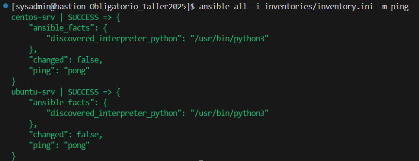
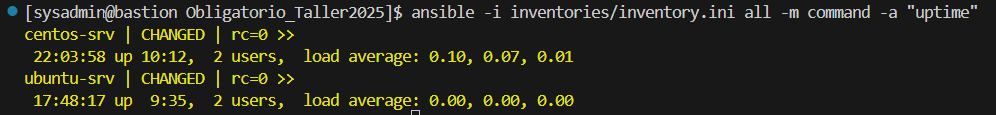
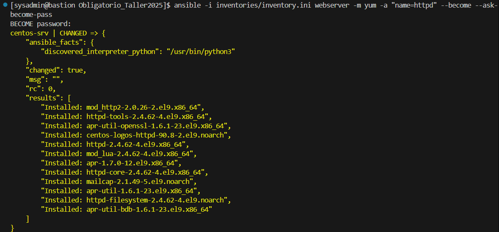
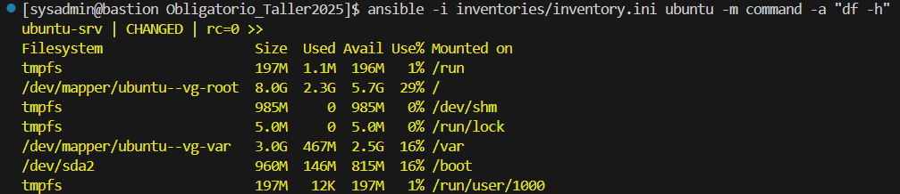

# Obligatorio Taller de Servidores Linux
## - Febrero 2025 -

Fátima Pereira (236544)

---
### Configuraciones iniciales

Para poder realizar la tarea indicada fue necesario configurar tres servidores Linux. El primero, que tiene la funcionalidad de bastion con Centos Stream 9, habiendole instalado ansible, git y generado su clave publica. Otro de servidor web con Centros Stream 9 y uno con Ubuntu 24.04. Estos servidores proporcionan un espacio propicio para realizar las pruebas correspondientes al uso de git y ansible. 
En cada uno de los servidores se realizan las particiones correspondientes para boot, root, var y swap, asignandole un espacio determinado de memoria.

captura de las particiones

Estos servidores tienen dos interfaces de red, una interna y otra NAT para poder recibir instrucciones desde el bastion y poder conectarse a internet.  

En todos los servidores se crea el usuario sysadmin y se copia la clave publica del servidor bastion a los demas servidores para que puedan ser administrados por ssh.

> ### Creacion de repositorio y conexion a github

En primera instancia copiamos la clave publica del servidor bastion a nuestro usuario de github.

Se crea un repositorio publico en GitHub con el nombre Obligatorio_Taller2025 y se inicializa el archivo README.

En el servidor Centos usado como de bastion se clona el repositorio creado anteriormente con el comando: `git clone git@github.com:epamitaf/Obligatorio_Taller2025.git` para poder tener la staging area.

Luego de realizados los cambios permitenentes, se ejecuta el comando: `git add .` agregarando los cambios realizados hasta ese momento. Una vez realizado esto, se ejecuta el comando: `git commit -m "comentario"` para indicar los cambios realizados. Luego, para realizar la sicronizacion del repositorio local con el repositorio remoto, se ejecuta el comando: `git push`.

> ### Pruebas comandos adhoc

Para chequear que el inventario esta funcionando de forma correcta y que la conexion a los servidores indicados en este es satisfactoria, se ejecuta el comando: `ansible all -i inventories/inventory.ini -m ping`.

Para verificar el tiempo de actividad de los servidores es necesario ejecutar el comando: `ansible -i inventories/inventory.ini all -m command -a "uptime"`.

Para instalar apache en los servidores web es necesario ejecutar el comando: `ansible -i inventories/inventory.ini webserver -m yum -a "name=httpd" --become --ask-become-pass`.

Para indicar el uso de espacio en disco de los servidores Ubuntu es neceario ejecutar el comando: `ansible -i inventories/inventory.ini ubuntu -m command -a "df -h"`.

> ### Creacion de Playbooks

> ### web_setup.yml

Para poder instalar y configurar apache en el servidor web fue necesario realizar un playbook que despliegue 

COSAS PARA AGREGAR A ESTE INSTRUCTIVO!!! 
Detallas las colecciones usadas y el comanod para instalarla.

